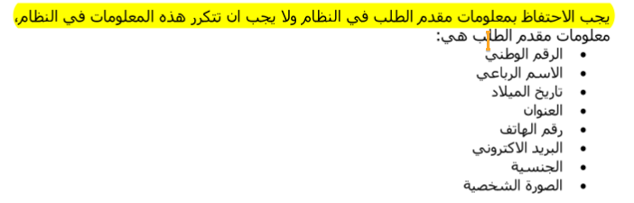

- > [!WARNING]
  >
  > Persons/Applicants ?? (With Details)

  - 
  - .png)

- Orders(With Details)

  - .png)

- > [!CAUTION]
  >
  > Order_Types/ServicesTypes(Services) (With Details)
  >

  - > [!WARNING]
    >
    > .png)
    
    - serviceID, Description, fees

- Order_Status (With Details)

- Licensee_‫‪Classes 

  - .png)

- Tests_Classes ?

  - .png)

- Tests (brdidge_table)?

- Licensees

  - .png)

- **`Users`**

  - .png)

- **`Persons`**

  - .png)
  
- **LicenseSeizures**

  - .png)